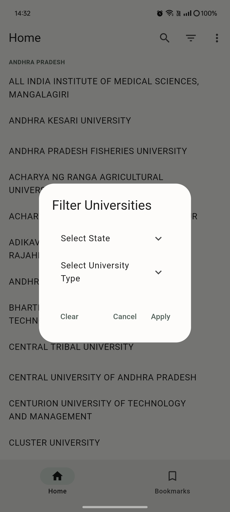

# Indian Universities

    

 Search and Navigate your career options
List of all the Indian Universities in one place 

## Features
- [x] Search for universities
- [x] Filter universities by Name, State, and Type
- [x] View university details
- [x] Add universities to your favorites list
- [x] Cloud Sync your favorite universities
- [x] Navigate your University on Google Maps
- [x] A direct link to the university website

## Screenshots

    
    
    
    

## Source of Data
The data is collected from the official website of the All India Survey on Higher Education (AISHE). The data is available in the public domain and can be accessed [here](https://dashboard.aishe.gov.in/hedirectory/#/institutionDirectory/universityDetails/U/ALL).

Data is available in the form of a CSV file. The raw data is cleaned and later converted into list format for easy access.
